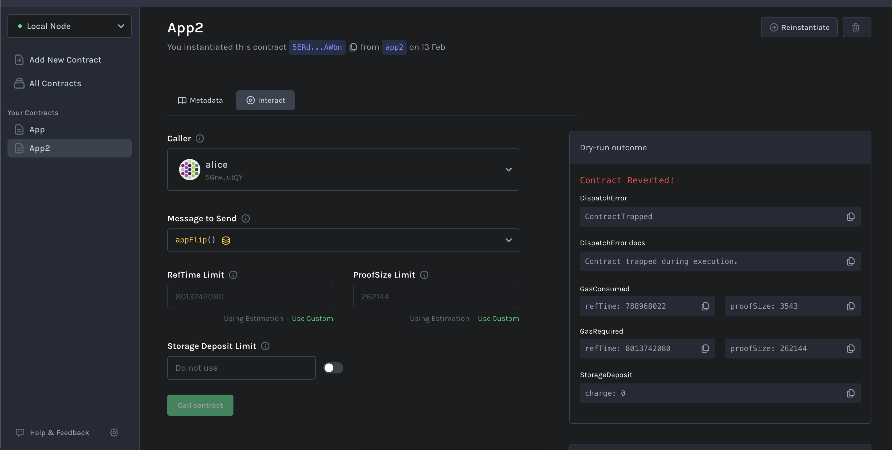
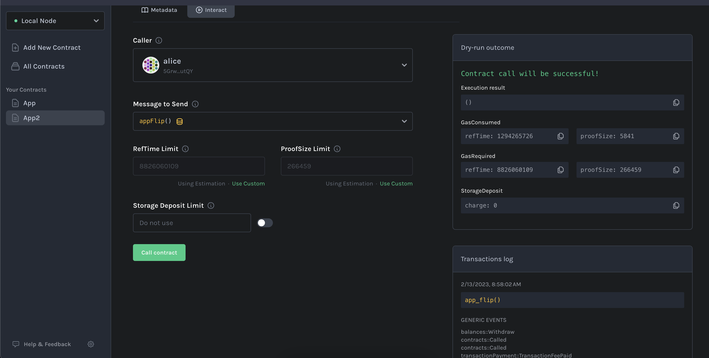

# Instruction to use this cross-contract calling smart contract

`Contract Trapped During Exucution error while cross-contract calling issue`

1.  Build app & app2 smart contract using the following command:

    - cargo contract build --release

2.  Upload .contract file of app1 and after thatn app2 to blockchain network either https://contracts-ui.substrate.io/ or https://polkadotjs-apps.web.app/#/contracts
3.  If you upload app2 smart contract with the following `constructor` code,
    then while calling `app_flip` function from app2 contract cause issue which is listed below:

         #[ink(constructor)]
         pub fn new(init_value: bool, app_ref: AppRef) -> Self {

             Self {
                 value: init_value,
                 app: app_ref,
             }
         }

4.  To call `app_flip` successfully from app2, uncomment the following code in app2 smart contract, then it works as follows:

        #[ink(constructor)]
        pub fn new(init_value: bool, app_code_hash: Hash, version: u32) -> Self {
            let total_balance = Self::env().balance();
            let salt = version.to_le_bytes();
            let app = AppRef::new(init_value)
                .endowment(total_balance / 4)
                .code_hash(app_code_hash)
                .salt_bytes(salt)
                .instantiate();

            Self {
                value: init_value,
                app: app.unwrap(),
            }
        }

